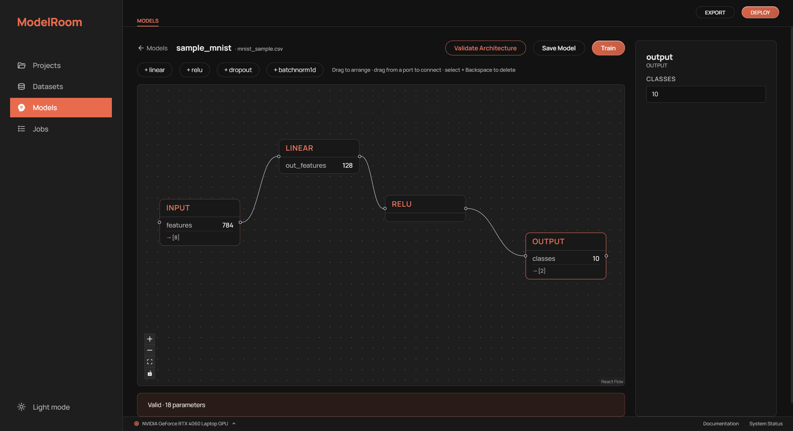

# ModelRoom



A local, single-user studio for building and training ML/DL models through a UI — import data, preprocess it, design a network visually, train it on your GPU with live metrics, and review the results. Runs entirely on your machine (FastAPI + PyTorch backend, React + Vite frontend).

## Requirements

- **Python** 3.11+
- **Node.js** 20+
- An **NVIDIA GPU + CUDA** is optional (training falls back to CPU).

## Install & run

One command sets up the Python venv, installs backend + frontend dependencies, starts both servers, and opens the app:

```bash
# Windows
run.bat

# macOS / Linux
./run.sh
```

Then open **http://localhost:5173** (backend runs on http://localhost:8000).

> **GPU training (NVIDIA):** the default install pulls the CPU build of PyTorch. For CUDA, install the matching wheels once:
> ```bash
> cd backend
> .venv/Scripts/python -m pip install torch torchvision --index-url https://download.pytorch.org/whl/cu124
> ```
> Pick a device in the status bar (bottom-left). `cu124` suits recent NVIDIA GPUs; use the index URL for your CUDA version if different.

Data lives in `~/.modelroom/` (SQLite DB + dataset files + run checkpoints).

## Using ModelRoom

1. **Projects** — create a project (it holds your models and training runs).
2. **Datasets** — upload a CSV (or load the built-in MNIST sample). Preview it, see distributions and correlations.
3. **Preprocess** — on a selected dataset, choose the **target** column and add steps (drop-nulls, impute, standardize, min-max, one-hot), then **Apply Pipeline** (fit on train, leakage-safe).
4. **Models** — pick the project, name a model, choose its training dataset, and design the network on the drag-and-connect canvas (Input → Linear/ReLU/Dropout/BatchNorm → Output). **Validate Architecture** checks shapes and connections live.
5. **Train** — set optimizer/lr/epochs/batch and the device, then **Start training**. Watch live loss/accuracy, pause/resume/stop, and see a confusion matrix + per-class metrics when it finishes.
6. **Jobs** — review runs, and select two to **Compare** their curves and metrics. Duplicate a model to make a new version and compare.

## Try it: MNIST

1. **Projects** → create a project (e.g. `MNIST`).
2. **Datasets** → click **"or load the MNIST sample"** (real MNIST via torchvision, flattened to 784 pixel features + `label`).
3. In the **Data Processing** panel: set **Target = `label`**, add a **standardize** step, click **Apply Pipeline** (→ 784 features, 10 classes).
4. **Models** → select the project → name it `mnist-mlp`, set **Training dataset = mnist_sample.csv**, **Create model**. It opens sized to the data (`784 → 10`).
5. (Recommended) build a deeper net for higher accuracy: `784 → Linear(128) → ReLU → Linear(64) → ReLU → 10`. Add layers with **+ linear / + relu**, set `out_features` in the properties panel, wire the nodes port-to-port, and remove the direct Input→Output edge (select it, press Backspace). **Validate Architecture**.
6. **Train** → epochs ≈ 12 → **Start training**. Expect **~95%+** validation accuracy; the confusion matrix and per-class precision/recall/F1 appear on completion.

## Project layout

```
backend/    FastAPI + PyTorch (datasets, preprocessing, model graph, training jobs, runs API)
frontend/   React + Vite + Tailwind UI
run.bat / run.sh   one-command setup + launch
```
